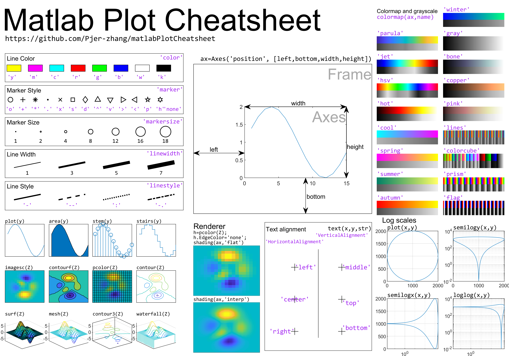
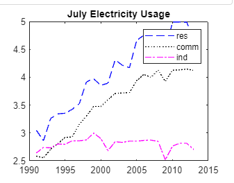

# Basics

## Comments
```Matlab
% I'm a comment
```

## Operations
### Math operations
```matlab
a = 5 * 3
b = a / 2
```

### Built-in variables


### Supress and hide the output
Add a semicolon ( ; ) after the expression.
```Matlab
a = 5 * 3; 
```

### Delete variables from workspace
```Matlab
clear
```

### Clear command window
```Matlab
clc
```

## Files
### Saving variables
**save filename** saves all variables from the current workspace in a binary MAT-file named filename. If filename exists, save overwrites the file.
```Matlab
save variables %creates a file named variables.mat
```

### Loading variables
```Matlab
load variables
```

### Functions
```Matlab
a = sin(90)
b = sqrt(4)
c = abs(-9)
```

## Vectors
### Row
Separate numbers with spaces or comas:
```Matlab
x = [7 9]
y = [3, 10, 5]
z = [sqrt(10) pi^2]
```

Other ways of declaring vectors:
```Matlab
x = 1:4 % [1 2 3 4] --> [start : end]
x = [3: 2: 9] % [3 5 7 9] --> [start : increment : end]
x = linspace(1, 2, 3) % [1.0  1.5  2.0] --> linspace(start, end, number_of_elements)
```

Operations with vectors
```Matlab
vec = [3, 10, 5]

x = vec + 1         % x = [4, 11, 6]
w = vec / 2         % w = [6, 20, 10]
z = vec * 2         % z = [1.5, 5.5, 2.5]

a = [3 4] * [10 20]     % Error * is for matrix multiplication 
b = [3 4] .* [10 20]    % .* multiplies elements --> b = [30 80]

m = max(vec)            % m = 10
[max, index] = max(x)   % max = 10, index = 2

n = size(vec) |% [1  3]
n = numel(vec) % 3
```

### Column
Separate with semi colon
```Matlab
u = [7; 9]
v = [8; 2; -4]
w = (1:3)' %transpose row vector
```

## Matrix
```Matlab
x = [5 6 7; 8 9 10]

a = size(x)           % a = [2 3]
[n, m] = size(x)      % n = 2,  m = 3
```

#### Random generation
rand()
```Matlab
y = rand(2) %2x2
y = 
    0.8147    0.1270
    0.9058    0.9134


z = rand(2,3) %2x3
z = 
    0.6324    0.2785    0.9575
    0.0975    0.5469    0.9649

rand(size(x)) % creates random matrix with its size
```

zeros()
```Matlab
t = zeros(2, 3)
t =
    0   0   0
    0   0   0
```

randi()

```Matlab
X = randi(imax) % returns a random integer between 1 and imax.

x = randi(imax,n) % returns an n-by-n matrix of random integers from interval [1,imax].

X = randi(imax, rows, cols) % randi(10,3,4) returns a 3-by-4 array of integers between 1 and 10.

x = randi(imax,[rows cols]) % randi(10,[3 4]) returns a 3-by-4 array of integers between 1 and 10.
```

### Indexing

!! IN MATLAB THE FIRST VECTOR ELEMENT IS 1 NOT ZERO

```Matlab
mat = 
      8    5    1
      9    4    2
      3    6    0

a = mat(2, 1)      % a = 5
b = mat(end, 2)    % b = 6
c = mat(end-1, 3)  % c = 2

d = mat(:, 2) % : means "all elements"
d = 
    5
    4
    6

e = mat(1, :) %1st row, all columns
e = 
    8   5   1

f = mat(1:2, :)
f =
    8    5    1
    9    4    2
```

### Replacing elements

```Matlab
f(1) = 11
f =
    11    5    1
    9     4    2
```

## Tables

```Matlab
d = elements.Density
d =
    0.5300
    1.7800
    0.8500
    ...

elements.Mass = elements.Density .* elements.Volume1 % adds another column with the results


```

## Plot


```Matlab
plot(x, y)
plot(x, y, "color line") % example: plot(v1, v2,"r*")

plot(vector) % x varies from 1 to n (vector length) and y is vector values

plot(v, "Linewidth", 3)
plot(x, y,"ro-","LineWidth",4)

hold on % to graph two functions on the same graph
hold off % to stop doing that
legend("Exp A", "Exp B") % If you have 2 graphs, one legend for each one

title("Sample Graph")
ylabel("Mass (g)")
xlabel("Time (s)")

xlim([xmin xmax]) % sets the axis limits in the current axes to the specified values

```

Practical example

```Matlab
yrs = 1991:2013

plot(yrs, res, "b--")
hold on
plot(yrs, comm, "k:")
plot(yrs, ind, "m-.")
hold off

title("July Electricity Usage")
legend("res", "comm", "ind")
```

