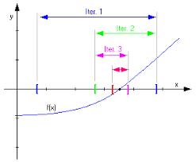
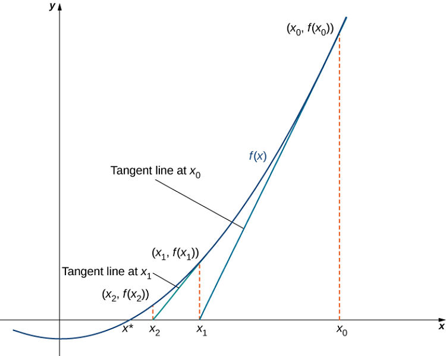

# Métodos

## Bisección

* [función](./funciones/biseccion.m)
* [implementación](./implementaciones)

## Newton-Raphson

* [función](./funciones/newton-raphson.m)
* [implementación](./implementaciones)

## Ex
* [función](./funciones)
* [implementación](./implementaciones)
